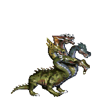

<!-- 

<h2>
Hi, I'm Alex! I'm on my way to become a strong Python developer! 🔥
</h2>

 

&ast; fyi, these nice images are from the best video game ever made: [**Heroes of Might and Magic III**](https://www.gog.com/game/heroes_of_might_and_magic_3_complete_edition) ⚔🔮 -->

